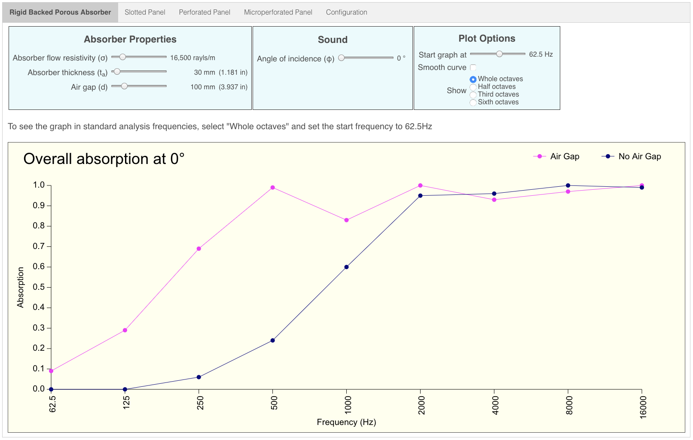

# Porous Absorber Calculator

Calculates the acoustic absorption curve of a variety of porous absorber devices mounted against a rigid backing such as a brick wall.

The porous absorber is typically made from some material such as Rockwool or glass fibre insulation.  You need to know the flow resistivity of this material in order to get the best results from these calculations.

<!--------------------------------------------------------------------------------------------------------------------->

## Usage

When the app starts, the "Rigid Backed Porous Absorber" tab will be selected by default.

If this is the first time you have run this calculator, then all calculations will be performed using default values.  If you have used this calculator before, then each of the curves will be plotted using your previous values.

<!--------------------------------------------------------------------------------------------------------------------->

## Absorber Device Types

At the moment, three absorber devices have been implemented:

* [Rigid Backed Porous Absorber](./docs/rb_porous_absorber.md)
* [Slotted Panel](./docs/slotted_panel.md)
* [Perforated Panel](./docs/perforated_panel.md)

There is also a [configuration](./docs/configuration.md) screen on which you can change less frequently altered values such as air temperature and pressure.

<!--------------------------------------------------------------------------------------------------------------------->

## Online Version

An online version of this tool is available [here](http://whealy.com/acoustics/PA_Calculator/index.html)

<!--------------------------------------------------------------------------------------------------------------------->

## Graph

If desired, the "Smooth curve" checkbox can be switched on.  This will connect each plot point using Bézier curves; however, it should be noted that this feature was added for its aesthetic appeal and does ***not*** imply that the actual absorption between the plot points follows the line drawn on the screen

### Graph start frequency

The graph always plots an 8 octave range starting at the specified start frequency.  Normally, this should be left set to 62.5 Hz in order to see the standard analysis range (i.e. up to 16 KHz).  However, should you wish to, you can set the start frequency to be as low as 20 Hz, in which case, you will still see an 8 octave range, but the upper limit will now be 5.1 KHz

### Input using sliders

All inputs are made using the range sliders.  The sliders can be moved either by dragging the button with the mouse, or for more precise input, select the slider and use the left/right arrow keys.

I decided to use sliders as the input UI element instead of simple input fields for two reasons:

1. It prevents invalid or out of range values from being entered, thus ensuring that the calculation engine always receives valid input
2. It creates an "animation" effect whereby you can see how the absorption curve changes dynamically as you move a slider

<!--------------------------------------------------------------------------------------------------------------------->

## Local Storage

This app uses the browser's local storage to remember your absorber device parameters.  If at anytime you wish to clear these cached values, select the "Configuration" tab and press the "Clear Cache" button.  Only the values pertaining to this application are cleared from local storage.

It is possible that after a new version of this app is released, old values in the local storage cache might cause you to see an empty chart.  If this happens, clear the local storage cache and refresh your browser page.

<!--------------------------------------------------------------------------------------------------------------------->

## Local Installation

These instructions assume you have already installed Rust and `wasm-pack`, and that Python3 is available to act as a Web server.

1. Clone this repo
2. Change into the repo's top-level directory
3. Compile using `wasm-pack build --release --target web`
4. Start a Python3 Web server using `python3 -m http.server`
5. Visit <http://0.0.0.0:8000>

<!--------------------------------------------------------------------------------------------------------------------->

## Background

This app is the reimplementation of an [Excel spreadsheet](http://whealy.com/acoustics/Porous.html) I wrote in 2004 and is part of an on-going exercise in learning Rust and cross-compiling it to Web Assembly using [wasm-pack](https://rustwasm.github.io/wasm-pack/installer/) and [wasm-bindgen](https://rustwasm.github.io/wasm-bindgen/introduction.html).

<!--------------------------------------------------------------------------------------------------------------------->

## To Do

Implement the calculations for a micro-perforated panel above an air gap.  No porous absorber material is needed in this type of device.

Display the value of each plot point when the mouse pointer hovers it

<!--------------------------------------------------------------------------------------------------------------------->

## Caveat

The author has taken every reasonable step to ensure that the calculations are accurate to the equations and methodology documented in the book "*Acoustic Absorbers and Diffusers.  Theory, Design and Practice*" by Trevor Cox and Peter D'Antonio (First Edition).  The author also recognises that this book is now in its third edition and therefore, certain calculations may have been modified or revised; consequently, the graphs plotted by this tool may vary from those plotted by a tool based on the most recent version of this book.

<!--------------------------------------------------------------------------------------------------------------------->

## Known Issues

None so far

<!--------------------------------------------------------------------------------------------------------------------->

## Support

Support *can* be provided but I cannot guarantee a prompt response...

<!--------------------------------------------------------------------------------------------------------------------->

## Contributing

Chris Whealy  <chris@whealy.com>

<!--------------------------------------------------------------------------------------------------------------------->

## License

This project is licensed under the Apache Software License, Version 2.0 except as noted otherwise in the [LICENSE](LICENSE) file.

