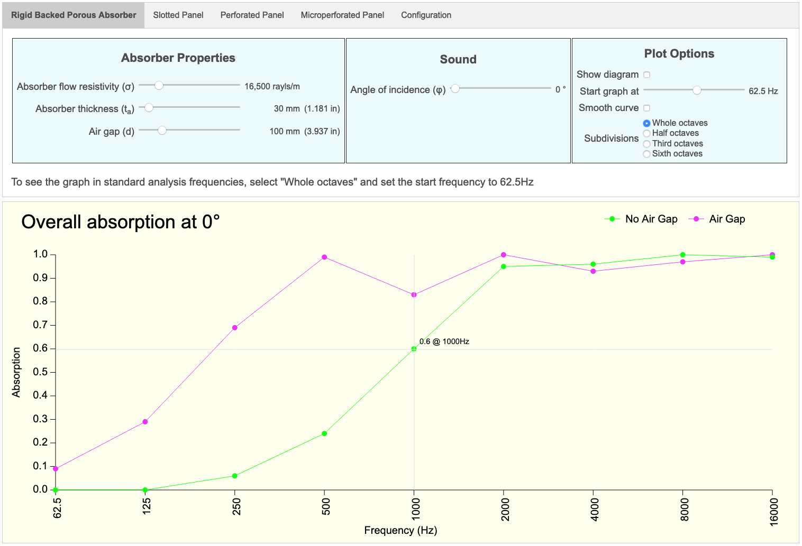
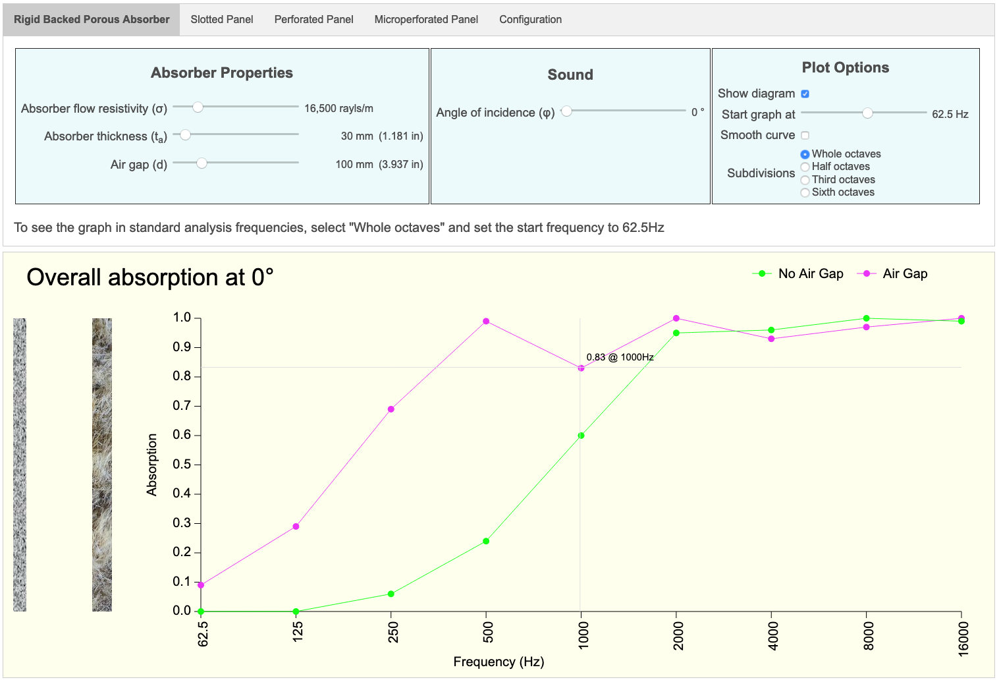
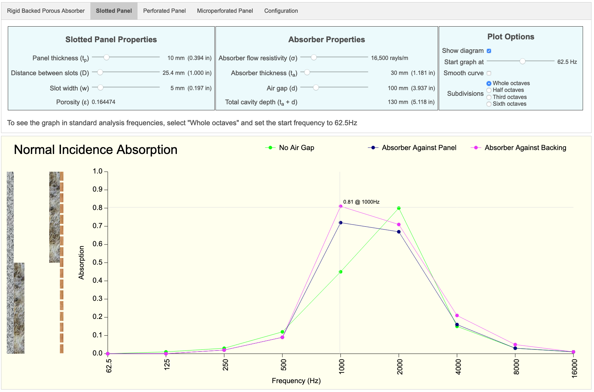
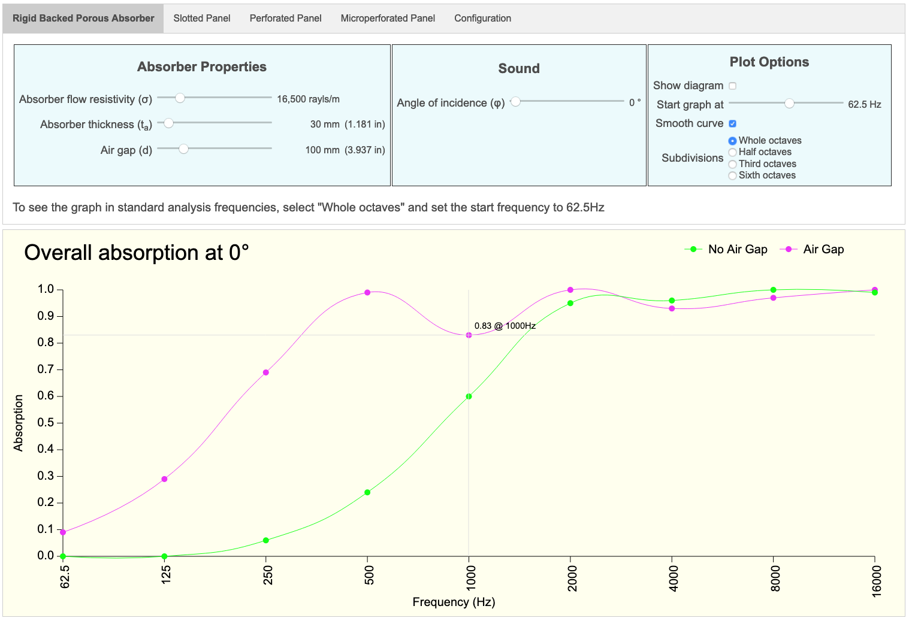
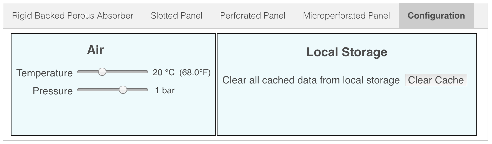

<a name="top"></a>
# Porous Absorber Calculator

This app is designed to assist acousticians when designing environments such as home cinemas.  It calculates the acoustic absorption curve of a variety of absorption devices mounted against a rigid backing such as a brick wall.

The porous absorber is typically made from some material such as Rockwool or glass fibre insulation.  You need to know the flow resistivity of this material in order to get the best results from this tool.


<!--------------------------------------------------------------------------------------------------------------------->
<a name="background"></a>
## Background

This app is the reimplementation of an [Excel spreadsheet](http://whealy.com/acoustics/Porous.html) I wrote in 2004.  It was rewritten as part of an on-going exercise in learning Rust and cross-compiling to Web Assembly using [wasm-pack](https://rustwasm.github.io/wasm-pack/installer/) and [wasm-bindgen](https://rustwasm.github.io/wasm-bindgen/introduction.html).


<!--------------------------------------------------------------------------------------------------------------------->
<a name="usage"></a>
## Usage

When the app starts, the "Rigid Backed Porous Absorber" tab will be selected by default.



If this is the first time you have run this calculator, then all calculations will be performed using default values.

If you have used this calculator before, then each of the curves will be plotted using your previous values.

As you move the mouse pointer over the chart, cross hairs will appear and the absorption value at a particular frequency will be displayed when the mouse hovers over a plot point.


<!--------------------------------------------------------------------------------------------------------------------->
<a name="device-types"></a>
## Absorber Device Types

Four absorber device types have been implemented:

* [Rigid Backed Porous Absorber](./docs/porous_absorber.md)
* [Slotted Panel](./docs/slotted_panel.md)
* [Perforated Panel](./docs/perforated_panel.md)
* [Microperforated Panel](./docs/microperforated_panel.md)

There is also a [configuration](./docs/configuration.md) screen on which you can change less frequently altered values such as air temperature and pressure.


<!--------------------------------------------------------------------------------------------------------------------->
<a name="online-version"></a>
## Online Version

An online version of this tool is available [here](http://whealy.com/acoustics/PA_Calculator/index.html)


<!--------------------------------------------------------------------------------------------------------------------->
<a name="graph"></a>
## Graph

The graph maintains an aspect ratio of 21:9 as the browser screen resizes and has an arbitrary minimum width of 1000 pixels.

### Show Diagram

When switched on, a cross-section of the absorption device will be displayed on the left of the chart.

The graphic shows the wall on the far left, then the air gap, then the porous absorber layer, and finally if relevant, the slotted/perforated panel on the right.



As you change the dimensions of the air gap and porous absorber layer, the diagram changes to show the device dimensions in proportion to each other.

For devices using both a panel and a porous absorption layer, the diagram is split in half.  The top half shows the absorber against the panel, and the bottom half shows the absorber against the rigid backing.




### Smooth Curve

If desired, the "Smooth curve" checkbox can be switched on.  This will connect each plot point using Bézier curves; however, it should be noted that this feature was added for its aesthetic appeal and does ***not*** imply that the actual absorption between the plot points follows the line drawn on the screen




### Start frequency

The graph always plots an 8 octave range starting at the specified start frequency.  Normally, this should be left set to 62.5 Hz in order to see the standard analysis range (i.e. up to 16 KHz).  However, should you wish to, you can set the start frequency to be as low as 20 Hz, in which case, you will still see an 8 octave range, but the upper limit will now be 5.1 KHz

### Input using sliders

All inputs are made using the range sliders.  The sliders can be moved either by dragging the button with the mouse, or for more precise input, select the slider and use the left/right arrow keys.

I decided to use sliders as the input UI element instead of simple input fields for two reasons:

1. It prevents invalid or out of range values from being entered, thus ensuring that the calculation engine always receives valid input
2. It creates an "animation" effect whereby you can see how the absorption curve changes dynamically as you move a slider


<!--------------------------------------------------------------------------------------------------------------------->
<a name="local-storage"></a>
## Local Storage

This app uses the browser's local storage to remember your device parameters.  If at anytime you wish to clear these cached values, select the "Configuration" tab and press the "Clear Cache" button.  Only the values pertaining to this application are cleared from local storage.



It is possible that after a new version of this app is released, old values in the local storage cache might cause you to see an empty chart.  If this happens, clear the local storage cache and refresh your browser page.


<!--------------------------------------------------------------------------------------------------------------------->
<a name="local-installation"></a>
## Local Installation

These instructions assume you have already installed Rust and `wasm-pack`, and that Python3 is available to act as a Web server.

1. Clone this repo
1. Change into the repo's top-level directory
1. Ensure that you have installed [wasm-pack](https://rustwasm.github.io/wasm-pack/installer/) as per the instructions behind the link
1. Compile using `wasm-pack build --release --target web`

### Testing

To test this app locally, run the shell script `./test_server.sh` then visit <http://0.0.0.0:8000>

The purpose of this shell script is simply to ensure that the Python Webserver serves files of type `.wasm` with the correct MIME type of `application/wasm`.

Running this shell script is not a requirement; alternatively, you could simply start the default Python Webserver using the command `python3 -m http.server`.  Using this approach however, you will see the following non-fatal error in your browser console:

```
porous_absorber_calculator.js:242 `WebAssembly.instantiateStreaming` failed because your server does not serve wasm with `application/wasm` MIME type.
Falling back to `WebAssembly.instantiate` which is slower.
Original error: TypeError: Failed to execute 'compile' on 'WebAssembly': Incorrect response MIME type. Expected 'application/wasm'.
```


### Debug/Trace Output

If you wish switch on debug/trace output, then you need to switch the `TRACE_ACTIVE` flag in the relevant module.

For each module in which debug/trace output is relevant, locate the line

```rust
const TRACE_ACTIVE: bool = false;
```

Change the value to `true`, recompile using `wasm-pack` and the perform a hard refresh of the browser page.  Debug/trace output will then be visible in the browser console whenever control passes through that particular module.


<!--------------------------------------------------------------------------------------------------------------------->
<a name="to-do"></a>
## To Do

Nothing so far


<!--------------------------------------------------------------------------------------------------------------------->
<a name="caveat"></a>
## Caveat

I realise that this app is an implementation of the ***theory*** of how acoustic absorption can be calculated.  I cannot make any guarantee that reality will match up to the results of these calculations!

I havae also taken every reasonable step to ensure that the calculations are accurate to the equations and methodology documented in the book "*Acoustic Absorbers and Diffusers.  Theory, Design and Practice*" by Trevor Cox and Peter D'Antonio (First Edition).  However, this book is now in its third edition and therefore certain calculations may have been modified or revised; consequently, the graphs plotted by this tool may vary from those plotted by a tool based on the most recent version of this book.


<!--------------------------------------------------------------------------------------------------------------------->
<a name="known-issues"></a>
## Known Issues

For best results, view this app use Brave, Google Chrome or Firefox Quantum browsers from a desktop machine.

This app has ***not*** been optimized for display on mobile devices.


<!--------------------------------------------------------------------------------------------------------------------->
<a name="support"></a>
## Support

I can provide a limited level of support; however, I cannot guarantee a prompt response...


<!--------------------------------------------------------------------------------------------------------------------->
<a name="contributing"></a>
## Contributing

Chris Whealy  <chris@whealy.com>


<!--------------------------------------------------------------------------------------------------------------------->
<a name="license"></a>
## License

This project is licensed under the Apache Software License, Version 2.0 except as noted otherwise in the [LICENSE](LICENSE) file.
