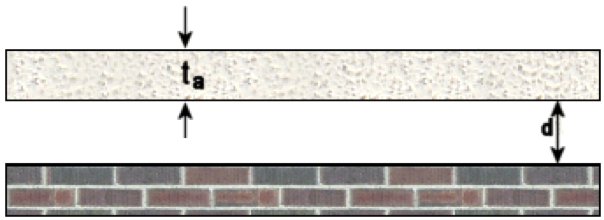

# Rigid Backed Porous Absorber

A porous absorber layer of thickness ***ta*** is mounted over a rigid backing.

Two absorption curves are calculated:

* The porous absorber layer is mounted directly to the rigid backing, or
* The porous absorber is mounted above an air gap of depth ***d***
    

## Default Graph

## Value Ranges

| Property | Min | Default value | Max |
|---|---|---|---|
| Absorber thickness | 5 mm | 30 mm | 500 mm
| Absorber flow resistivity | 100 rayls/m | 16,500 rayls/m | 100,000 rayls/m
| Cavity air gap | 0 mm | 100 mm | 500 mm
| Angle of indcidence | 0° | 0° | 89°
| Graph start frequency | 20 Hz | 62.5 Hz | 100 Hz
| Octave subdivisions | 1 | 1 | 1, 2, 3 or 6
