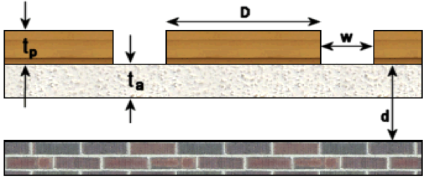
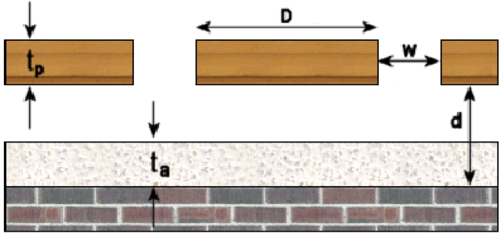
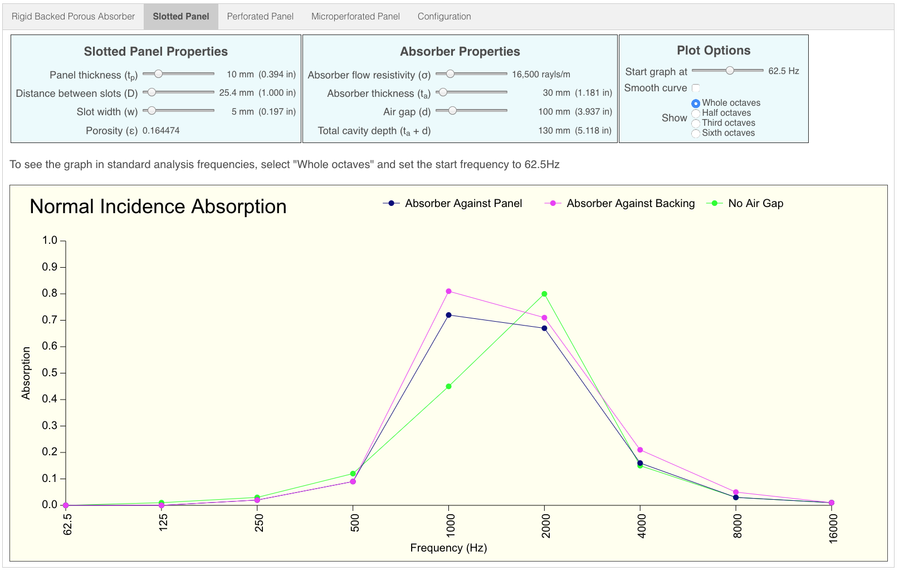

# Slotted Panel

A slotted panel of thickness ***tp*** with slots of width ***w*** at a spacing ***D*** is mounted above a cavity whose total depth is ***d*** and containing a porous absorber layer of thickness ***ta***.

Three absorption curves are calculated:  

* The slotted panel is mounted directly to the porous absorber layer, which in turn is mounted directly to the rigid backing.  I.E. The air gap is zero.

* Slotted Panel -> Porous Absorber -> Air Gap -> Backing 
     

* Slotted Panel -> Air Gap -> Porous Absorber -> Backing
     

## Default Graph

## Value Ranges

| Property | Min | Default value | Max |
|---|---|---|---|
| Panel thickness | 1.0 mm | 10 mm | 50.0 mm
| Slot distance | 2.0 mm | 25.4 mm | 300 mm
| Slot width | 1.0 mm | 5.0 mm | 50.0 mm
| Absorber flow resistivity | 100 rayls/m | 16,500 rayls/m | 100,000 rayls/m 
| Absorber thickness | 5 mm | 30 mm | 500 mm
| Air gap | 0 mm | 100 mm | 500 mm
| Graph start frequency | 20 Hz | 62.5 Hz | 100 Hz
| Octave subdivisions | 1 | 1 | 1, 2, 3 or 6

